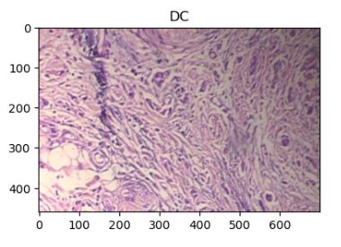
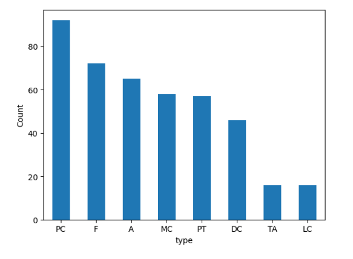
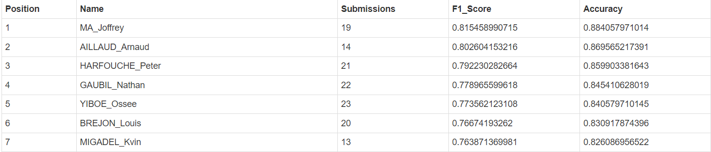

# Data-challenge-IP-Paris

## **Breast Tumor Histopathological Image Classification**
This project aims to classify breast tumor tissue based on histopathological images. The dataset consists of 3-channel RGB images in PNG format with dimensions of 700x460 pixels and 8-bit depth in each channel.

### **Challenge**

With only 422 images available for classification, the dataset is relatively small, which can make it difficult to train models that are capable of accurately distinguishing between the different classes. Training a DNN is complicated and time consuming. Additionally, the presence of eight classes further compounds the challenge, as each class requires its own unique set of features and classification techniques to achieve accurate results. Finally, the significant imbalance between the number of samples in each class can lead to biased models that overemphasize the dominant classes and struggle to classify samples from the underrepresented classes. I choose to use only traditional computer vision.

### **Methodology**
To extract features from the images, we used a combination of Scale-Invariant Feature Transform (SIFT) and Bag-of-Words (BOW). Specifically, we concatenated the following features: SIFT features, Local Binary Patterns (LBP), color histogram, Haralick texture features, and Triangular Clustered Autoencoder-based Softmax (TCAS) features. This resulted in a feature matrix of size df_features.

Next, we trained an ensemble of classifiers to predict the tumor class. The ensemble consisted of four classifiers: Random Forest, Support Vector Machine (SVM), Gradient Boosting, and XGBoost. We used a Voting Classifier with 'soft' voting to combine the predictions of the individual classifiers. We also used class weights to address the imbalanced nature of the dataset. The hyperparameters for each classifier are as follows:

Random Forest: n_estimators=100, max_depth=100, class_weight='balanced', n_jobs=-1, random_state=30
SVM: kernel='linear', probability=True, class_weight='balanced', C=0.01, random_state=1
Gradient Boosting: n_estimators=100, learning_rate=0.05, max_depth=3, random_state=30
XGBoost: learning_rate=0.01, n_estimators=100, max_depth=10, n_jobs=-1, random_state=30
We evaluated the performance of the ensemble using 16-fold cross-validation with the f1_weighted scoring metric. The mean and standard deviation of the cross-validation scores are reported in the output.

### **Results**

The ensemble of classifiers achieved a mean f1_weighted score of 0.7789 with an accuracy of 0.8454. This suggests that the ensemble is able to accurately classify the breast tumor tissue based on the histopathological images.

### **Usage**
To use this code, simply clone the repository and run the main.ipypb. Make sure to install all the required packages listed in requirements.txt.

